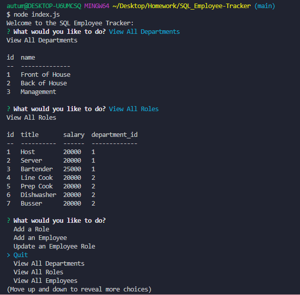

# SQL_Employee-Tracker


## Description
```md
For this homework assignment we are tasked with creating an employee database using SQL that is updated and viewed in a terminal with command-line prompts using node. 
``` 

Acceptance Criteria:

```md
GIVEN a command-line application that accepts user input
WHEN I start the application
THEN I am presented with the following options: view all departments, view all roles, view all employees, add a department, add a role, add an employee, and update an employee role
WHEN I choose to view all departments
THEN I am presented with a formatted table showing department names and department ids
WHEN I choose to view all roles
THEN I am presented with the job title, role id, the department that role belongs to, and the salary for that role
WHEN I choose to view all employees
THEN I am presented with a formatted table showing employee data, including employee ids, first names, last names, job titles, departments, salaries, and managers that the employees report to
WHEN I choose to add a department
THEN I am prompted to enter the name of the department and that department is added to the database
WHEN I choose to add a role
THEN I am prompted to enter the name, salary, and department for the role and that role is added to the database
WHEN I choose to add an employee
THEN I am prompted to enter the employee’s first name, last name, role, and manager, and that employee is added to the database
WHEN I choose to update an employee role
THEN I am prompted to select an employee to update and their new role and this information is updated in the database 
```

## Screenshots:
Video of how application works
>https://drive.google.com/file/d/1QyxZuoivtKd0EQtPlfYXVlpTanSMWDvF/view?usp=sharing


Webpage:




##  Installation
  Instruction for installing and running project:
  * Open index.js and make sure to change the user and password needed to connect to mysql.
  * Open the terminal run the command 'npm install'
  * Run the command 'node index.js'
  * Enjoy the application!


## Link to gitHub Repository:
>  https://github.com/autumnlf/SQL_Employee-Tracker